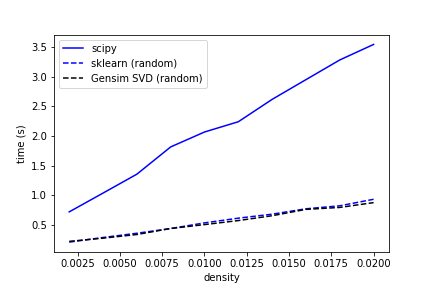
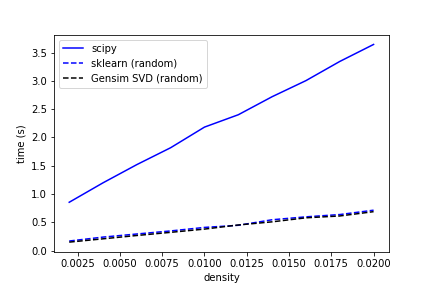
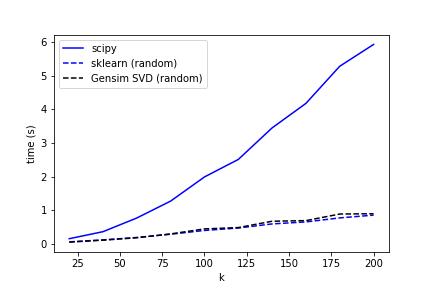
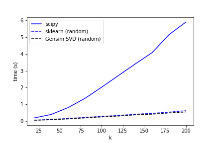
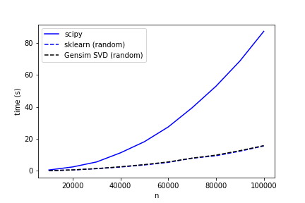

# Sparse SVD Benchmark (Python)

Key findings:

* [sparsesvd](https://pypi.org/project/sparsesvd/) is really slow and thus was not considered for the graphs
* There is almost not differnce between the implementation of truncated (randomized) SVD with [Gensim SVD](https://radimrehurek.com/gensim/models/lsimodel.html#gensim.models.lsimodel.stochastic_svd) and [Scikit-Learn SVD](https://scikit-learn.org/stable/modules/generated/sklearn.decomposition.TruncatedSVD.html)
* MKL is faster than OpenBlas for the truncated SVD (not clearly vissible in the graphs, sorry for this)
* Truncated is faster as the problem gets more difficult

## Setup

Done on i3 8100, Python 3.6, Ubuntu 18.04, average of 5 runs, with the recent version of OpenBlas and MKL as of 18th June 2019.

Check out the accompanying [notebook](benchmark_svd.ipynb).

## Results

OpenBlas            |  MKL
:-------------------------:|:-------------------------:
  |  
  |  
  |  

## Acknowledgements

Based on previous work:
* https://simplyml.com/benchmarking-the-singular-value-decomposition/
* https://github.com/charanpald/tyre-hug/blob/master/tyrehug/exp/svdbenchmark.py

## License

MIT.